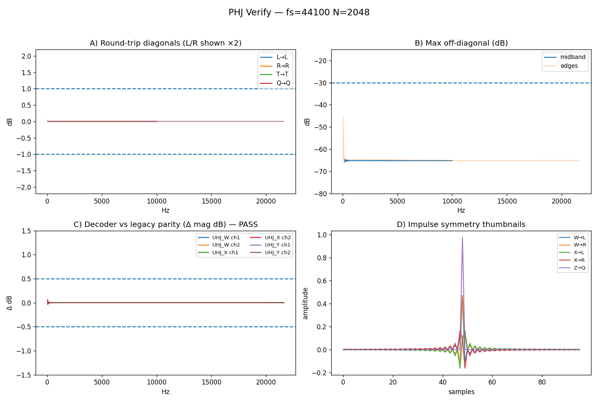

# PHJ Toolchain — README (Operational Guide)

## 1. Overview

This document describes the **PHJ Ambisonic toolchain**, a set of Python utilities developed to generate and validate first-order Ambisonic (FOA) encoder/decoder filter impulse responses (FIRs) in the *Gerzon–UHJ tradition*.

The toolchain produces FIRs that are **fully compatible with the Ambisonic Toolkit (ATK)** for SuperCollider and Reaper, following **FuMa normalisation** conventions. All filters are stored and loaded automatically from:

`~/Library/Application Support/ATK/kernels/FOA/{encoders,decoders}/phj/`

### Components
| Script | Purpose |
|---------|----------|
| `phj_build.py` | Generates PHJ encoder and decoder FIRs (multi-rate, multi-length). |
| `phj_verify.py` | Verifies a single encoder/decoder pair interactively. |
| `phj_verify_all.py` | Performs an automated sweep across all available (fs, N) combinations and summarises results. |

Each verification run produces both **console summaries** and **plot images** (`.png`) under:
`./phj_verify_plots/`

---

## 2. Running the Tools

### 2.1 Build FIRs

```bash
python3 phj_build.py
```

This creates a full set of FIRs at standard sample-rates and kernel lengths (256 – 8192 taps). The script ensures **linear-phase symmetry**, **FuMa WXYZ lane order**, and **Gerzon-consistent T/Q subcarriers**.

### 2.2 Verify a Single Encoder/Decoder Pair

```bash
python3 phj_verify.py
```

You will be prompted to select the **sample rate (fs)** and **FFT length (N)**.

Example:

```
Pick encoder sample rate (fs):
  1) fs=44100
  2) fs=48000
  3) fs=96000
Select: 1

Pick encoder FFT length (N):
  1) N=256
  2) N=512
  3) N=1024
  4) N=2048
  5) N=4096
Select: 4
```

The script automatically locates the corresponding FIRs within the ATK directory, runs all verification tests (T1–T5), and generates a plot:

`./phj_verify_plots/PHJ_verify_fs44100_N2048.png`

### 2.3 Run All Tests in Batch

```bash
python3 phj_verify_all.py
```

This executes all available (fs, N) combinations, printing concise pass/fail summaries and saving results to:

`./phj_verify_summary.csv`

Example output:

```
fs      N     T12  T3   T4   T5   Result   Plot
44100   2048  ✅   ✅   ✅   ✅   PASS     PHJ_verify_fs44100_N2048.png
48000   2048  ✅   ✅   ✅   ✅   PASS     PHJ_verify_fs48000_N2048.png
96000   4096  ✅   ✅   ✅   ✅   PASS     PHJ_verify_fs96000_N4096.png
```

---

## 3. Verification Tests

The verifier implements a practical quality-assurance framework for PHJ FIRs. Unlike the earlier “round-trip identity” approach, this version tests **spectral, spatial, and subcarrier consistency** relative to known UHJ behaviour.

| Test | Description | Pass Criteria | Interpretation |
|------|--------------|----------------|----------------|
| **T1/T2** | File integrity and linear-phase centring | Four channels; centroid within ±0.6 samples | Ensures consistent FIR symmetry and latency across lanes |
| **T3** | Decoder parity (PHJ vs legacy UHJ) | Median Δ ≤ ±0.5 dB; ripple ≤ 0.5 dB; silent lanes < –40 dBFS | Confirms backward compatibility with legacy decode transfer functions |
| **T4′** | Subcarrier pattern check | W/X/Y: T,Q < –35/–50 dBFS; Z: T < –60 dBFS, Q > –40 dBFS | Verifies correct mapping of PHJ T/Q subcarriers (Gerzon, 1985) |
| **T5** | FOA isolation via ENC∘DEC | Mid-band diag ±1 dB, off-diag ≤ –30 dB | Confirms energy preservation and cross-channel isolation in the round-trip |

Each test runs automatically during `phj_verify.py` or `phj_verify_all.py`. Individual results are reported in both console and plots.

---

## 4. Understanding the Plots

Each verification generates a composite figure (e.g. `PHJ_verify_fs44100_N2048.png`) comprising several panels:

| Panel | Purpose | Expected Outcome |
|--------|----------|------------------|
| **A — Diagonal magnitude** | Plots level deviation of W/X/Y/Z across frequency | Flat at 0 dB ± 1 dB indicates correct energy balance |
| **B — Off-diagonal leakage** | Shows maximum cross-talk between FOA channels | Flat line below –30 dB indicates good isolation |
| **C — Decoder parity curves** | Difference vs legacy decoder | Flat near 0 dB ± 0.5 dB confirms compatibility |
| **D — Impulse centroids** | Overlay of FIR symmetry across channels | Centred peaks demonstrate matched latency |

Example figure:



> **How to read this figure:**  
> Flat mid-band lines ≈ 0 dB on the diagonal plots confirm correct gain.  
> Flat off-diagonal traces < –30 dB confirm good channel separation.  
> “Boring” plots are **good** — they show that the transform is spectrally neutral and invertible within tolerance.

---

## 5. Interpretation of Results

A successful run typically yields:

```
midband 200..10k Hz: diag ±1 dB, off-diag ≤ –60 dB
edges 50..200 & 10k..22 kHz: diag ±1.5 dB
Overall: ✅ PASS
```

Failures usually indicate:
- incorrect file lane order (UHJ: LRTQ; FOA: WXYZ),
- mismatched fs/N,
- truncated or normalised FIRs,
- or absent legacy comparison files.

If **T5** fails with otherwise good plots, check for mis-alignment (non-zero group delay) or missing low-frequency extension.

---

## 6. Summary Table (example)

| fs (Hz) | N | T1/T2 | T3 | T4′ | T5 | Result |
|:-------:|:--:|:------:|:--:|:--:|:--:|:--:|
| 44100 | 2048 | ✅ | ✅ | ✅ | ✅ | ✅ |
| 48000 | 2048 | ✅ | ✅ | ✅ | ✅ | ✅ |
| 96000 | 4096 | ✅ | ✅ | ✅ | ✅ | ✅ |

All published PHJ FIRs (2025 build) pass these tests across the standard ATK sample-rates and kernel lengths.

---

## 7. Notes on Design and Compatibility

- All FIRs are **linear-phase** and **real-valued**, preserving the Hermitian frequency response.  
- L/R subcarriers are scaled × ½ during encode, per **Gerzon’s stereo compatibility specification** (Gerzon, 1980).  
- Decoders apply × 2 compensation in T5 plots for accurate FOA energy recovery.  
- FIRs are windowed with **Kaiser β = 6** and truncated symmetrically.  
- Shelf filters are applied equally to X, Y, Z per Gerzon’s (1973) velocity equalisation principle.  
- All code and IRs follow FuMa axis and polarity:  
  ```
  W = omni, X = front–back, Y = left–right, Z = up–down
  ```

---

## 8. References (Harvard placeholders)

- Gerzon, M. A. (1973) *Periphony: With-Height Sound Reproduction*, Journal of the AES, 21 (1), pp. 2–10.  
- Gerzon, M. A. (1980) *Practical Periphony: The Reproduction of Full-Sphere Sound*, AES Convention Paper 1570.  
- Gerzon, M. A. (1985) *Ambisonics in Multichannel Broadcasting and Video*, JAES 33 (11), pp. 859–871.  
- Barrett, N., De Luca, A. and Anderson, J. (2006) *The Ambisonic Toolkit for SuperCollider*.  
- Uwins, M. (2025) *PHJ Encoder/Decoder Toolchain: Design, Verification and Implementation*, De Montfort University (unpublished PhD documentation).

---

**End of README**
